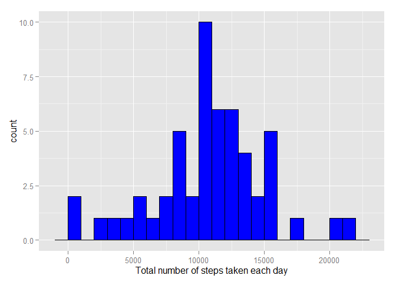
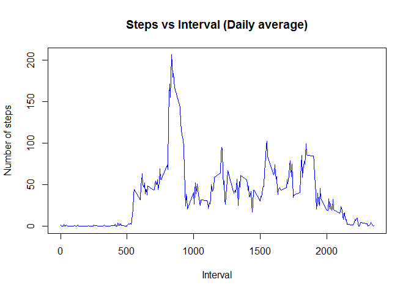
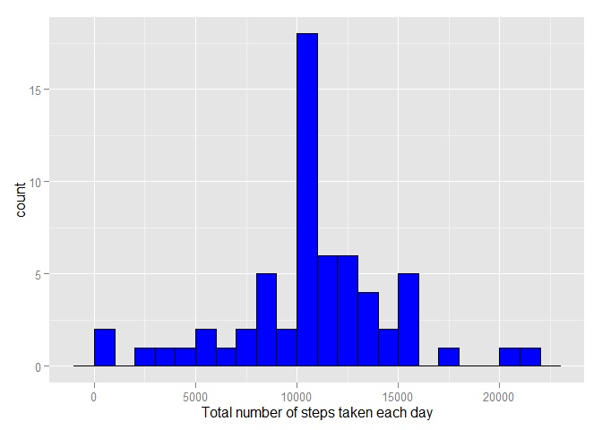
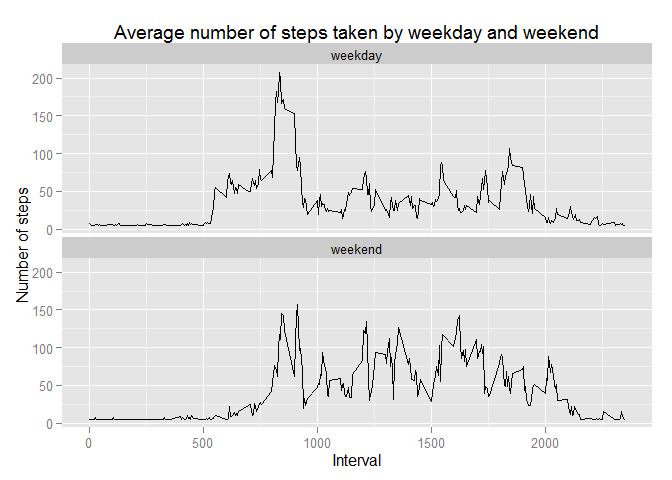

# Reproducible Research: Peer Assessment 1

## Loading and preprocessing the data
1. Read the csv file. Filename: activity.csv

```r
# Read the csv file.
file <-"C:\\Users\\kssam\\Desktop\\Coursera\\CourseraProject\\05 ReproducibleResearch\\RepData_PeerAssessment1\\activity.csv"

# Assign the data.
df <-read.csv(file,header = TRUE, sep=",")

# Sample the data
head(df)
```

```
##   steps       date interval
## 1    NA 2012-10-01        0
## 2    NA 2012-10-01        5
## 3    NA 2012-10-01       10
## 4    NA 2012-10-01       15
## 5    NA 2012-10-01       20
## 6    NA 2012-10-01       25
```

```r
# Understand the object data structure.
str(df)
```

```
## 'data.frame':	17568 obs. of  3 variables:
##  $ steps   : int  NA NA NA NA NA NA NA NA NA NA ...
##  $ date    : Factor w/ 61 levels "2012-10-01","2012-10-02",..: 1 1 1 1 1 1 1 1 1 1 ...
##  $ interval: int  0 5 10 15 20 25 30 35 40 45 ...
```

2. Process/transform the data into a format that suitable for analysis.

```r
# change the date field from factor to date format.
df$date <- as.Date(df$date,"%Y-%m-%d")

# double check the data type after the changes.
str(df)
```

```
## 'data.frame':	17568 obs. of  3 variables:
##  $ steps   : int  NA NA NA NA NA NA NA NA NA NA ...
##  $ date    : Date, format: "2012-10-01" "2012-10-01" ...
##  $ interval: int  0 5 10 15 20 25 30 35 40 45 ...
```

## What is mean total number of steps taken per day?
For this part of the assignment, missing values in the dataset will be ignore.
1. Make a histogram of the total number of steps taken each day

```r
# remove data with missing value (NA).
df_x_na <- na.omit(df)

# Sum the data steps by date.
tot_steps_date <- aggregate(steps ~ date, data=df_x_na, sum)

# ggplot histogram
library(ggplot2)
qplot(tot_steps_date$steps, binwidth = 1000, xlab = "Total number of steps taken each day", fill=I("blue"), col=I("black"))
```

 


2. Calculate and report the mean and median total number of steps taken per day

```r
# The answer for mean total number of steps taken per day.
mean_steps <- mean(tot_steps_date$steps)
mean_steps
```

```
## [1] 10766.19
```

```r
# The answer for median total number of steps taken per day.
median_steps <- median(tot_steps_date$steps)
median_steps
```

```
## [1] 10765
```
- The **mean** total number of steps taken per day is 1.0766189\times 10^{4}
- The **median** total number of steps taken per day is 10765

## What is the average daily activity pattern?
1. Make a time series plot (i.e. type = "l") of the 5-minute interval (x-axis) and the average number of steps taken, averaged across all days (y-axis)

```r
# Aggregate the steps as interval to get the average number of steps
mean_interval_steps <- aggregate(steps ~ interval, data=df_x_na, mean)

# Plot time series 
plot(steps ~ interval, data =mean_interval_steps, type='l', col= "blue", 
     main="Steps vs Interval (Daily average)", xlab="Interval", 
     ylab="Number of steps")
```

 


2. Which 5-minute interval, on average across all the days in the dataset, contains the maximum number of steps?

```r
# get the maximum number of steps. 
max_ave_steps <-mean_interval_steps[which.max(mean_interval_steps$steps), ]$interval
max_ave_steps
```

```
## [1] 835
```
The interval with maximum number of steps: 835

## Imputing missing values
Note that there are a number of days/intervals where there are missing values (coded as NA). The presence of missing days may introduce bias into some calculations or summaries of the data.

1. Calculate and report the total number of missing values in the dataset (i.e. the total number of rows with NAs)

```r
# sum of the total number of rows with NAs.
total_na_val <- sum(is.na(df))
total_na_val
```

```
## [1] 2304
```
Total 2304 rows are missing.


2. Devise a strategy for filling in all of the missing values in the dataset. The strategy does not need to be sophisticated. For example, you could use the mean/median for that day, or the mean for that 5-minute interval, etc.

```r
# Strategy to handle row with missing values
# 1. Ignore all rows with missing data?
# 2. Zeroised all missing data.
# 3. Apply mean/median of column to replace the data.
```

3. Create a new dataset that is equal to the original dataset but with the missing data filled in.

```r
# calculate mean  
new_df <- df
# calculate mean for new_df
for (i in 1:ncol(new_df)){
  new_df[is.na(new_df[,i]),i] <- mean(new_df[,i], na.rm = TRUE) #replace NA with mean
}
```


4. Make a histogram of the total number of steps taken each day and Calculate and report the mean and median total number of steps taken per day. Do these values differ from the estimates from the first part of the assignment? What is the impact of imputing missing data on the estimates of the total daily number of steps?

```r
# Aggregate the new_data steps by date.
new_tot_date_steps <- aggregate(steps ~ date, data=new_df, sum)

# ggplot histogram
# library(ggplot2)
qplot(new_tot_date_steps$steps, binwidth = 1000, xlab = "Total number of steps taken each day", fill=I("blue"), col=I("black"))
```

 

```r
# The answer for mean total number of steps taken per day.
new_mean_steps <- mean(new_tot_date_steps$steps)
new_mean_steps
```

```
## [1] 10766.19
```

```r
# The answer for median total number of steps taken per day.
new_median_steps <- median(new_tot_date_steps$steps)
new_median_steps
```

```
## [1] 10766.19
```
After imputed the missing data both mean and median is having the same value.  
- The **mean** total number of steps taken per day is 1.0766189\times 10^{4}  
- The **median** total number of steps taken per day is 1.0766189\times 10^{4}


## Are there differences in activity patterns between weekdays and weekends?
For this part the weekdays() function may be of some help here. Use the dataset with the filled-in missing values for this part.

1. Create a new factor variable in the dataset with two levels -- "weekday" and "weekend" indicating whether a given date is a weekday or weekend day.

```r
# add a new column indicating day of the week 
new_df$day <- weekdays(new_df$date)

# add a new column called day type and initialize to weekday
new_df$day_type <- c("weekday")

# If day is Saturday or Sunday, make day_type as weekend
for (i in 1:nrow(new_df)){
  if (new_df$day[i] == "Saturday" || new_df$day[i] == "Sunday"){
    new_df$day_type[i] <- "weekend"
  }
}

# convert day_time from character to factor
new_df$day_type <- as.factor(new_df$day_type)

# aggregate steps as interval to get average number of steps in an interval across all days
new_df_imputed <- aggregate(steps ~ interval + day_type, new_df, mean)
```


2. Make a panel plot containing a time series plot (i.e. type = "l") of the 5-minute interval (x-axis) and the average number of steps taken, averaged across all weekday days or weekend days (y-axis). The plot should look something like the following, which was created using simulated data:

```r
# make the panel plot for weekdays and weekends
#library(ggplot2)
qplot(interval, steps, data=new_df_imputed, geom=c("line"), xlab="Interval", 
      ylab="Number of steps", main="Average number of steps taken by weekday and weekend") + facet_wrap(~ day_type, ncol=1)
```

 


